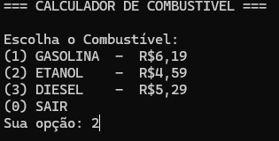

# ⛽ Fuel Calculator CLI

A simple and modular Command Line Interface (CLI) application built with Python to calculate fuel consumption and total trip cost based on:

- Distance traveled
- Vehicle average consumption (km/L)
- Selected fuel type

This project was developed focusing on clean code principles, modular architecture, and input validation.

---

## 🚀 Features

- Interactive CLI menu
- Fuel type selection (Gasoline, Ethanol, Diesel)
- Automatic calculation of:
  - Liters consumed
  - Total cost
- Robust input validation
- Clean modular structure
- Separation of business logic and interface

---

## 🏗 Project Structure

```
fuel_calculator/
│
├── fuel/
│   ├── **init**.py
│   └── methods.py        # Business logic (Fuel class)
│
├── untils/
│   ├── **init**.py
│   ├── gets.py           # Input handling and validation
│   └── ui.py             # CLI interface utilities
│
├── main.py               # Application entry point
├── requirements.txt
└── LICENSE

```
---

## 📊 How It Works

1. User selects fuel type
2. User enters:

   * Distance traveled (km)
   * Average consumption (km/L)
3. System calculates:

   * Liters consumed
   * Total cost based on predefined fuel prices
4. Displays formatted summary

---
## 📸 Screenshots

### 1. Main Menu


### 2. Chose Option


### 3. Resume Payment


### 4. Confirm Payment


### 5. Exemple CSV

---

## ▶️ How to Run

Clone the repository:

```bash
git clone <https://github.com/omarcelodev/fuel_calculator>
cd fuel_calculator
```

Run the application:

```bash
python main.py
```

---

## 🛠 Concepts Applied

* Object-Oriented Programming (OOP)
* Modular design
* Separation of concerns
* Input validation
* Clean Code principles
* Python package structure
* Reusability and refactoring

---

## 📌 Future Improvements

* Allow custom fuel price input
* Save calculation history to JSON
* Unit tests with pytest
* Transform into REST API
* Build GUI version

---

## 📜 License

This project is licensed under the MIT License.

---

## 👨‍💻 Author

Developed by Marcelo.


